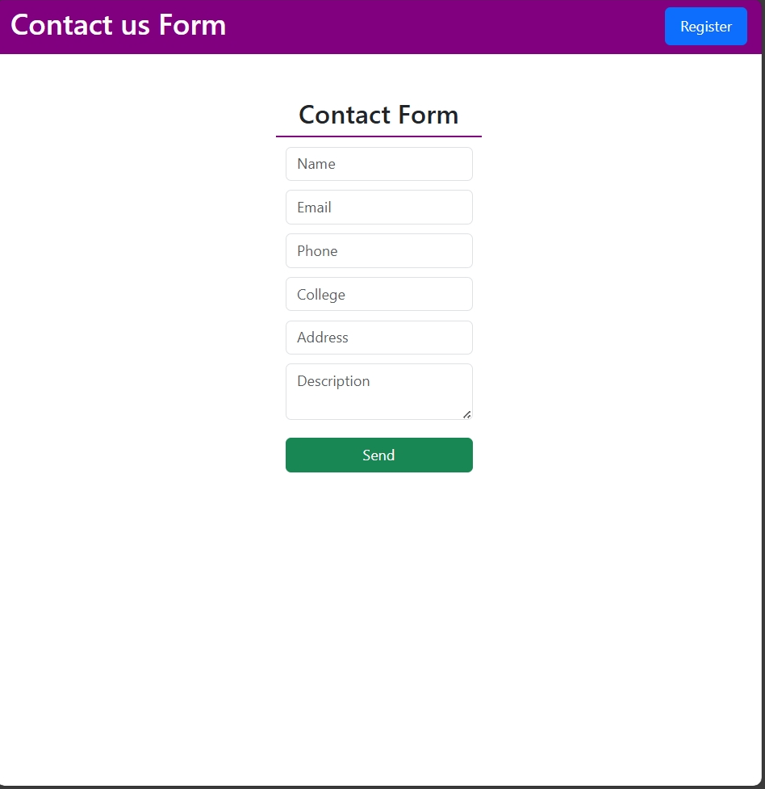

<h1 align="center" style="color:#2c3e50;">🧠 Contact Form Web</h1>

<p align="center">
  
</p>
A full-stack Contact Form Web Application built using the MERN stack (MongoDB, Express.js, React, Node.js) with Email Integration. Only registered users can submit the contact form. Contact data is sent directly to the admin's email using NodeMailer.

---

## 🚀 Features

- 🔐 **User Registration** – Register with email & password
- ✅ **Authentication** – JWT-based session verification
- 📬 **Contact Form** – Name, Email, Phone, College, Address & Description
- 📧 **Email Delivery** – Sends submitted data to admin email (`dr865550@gmail.com`)
- ❌ **Login Required** – Only logged-in users can submit the form
- 🎨 **Responsive UI** – Designed using Bootstrap 5 (CDN)
- 🛡️ **Secure** – Passwords hashed, environment variables protected

---

## 🖥️ Tech Stack

| Frontend        | Backend         | Database   | Email Service  |
|-----------------|------------------|------------|----------------|
| React (Vite)    | Express.js (Node)| MongoDB    | NodeMailer     |
| Bootstrap 5     | JWT Auth         | Mongoose   | Gmail SMTP     |

---

## 📝 Contact Form Fields

- Full Name
- Email Address
- Phone Number
- College Name
- Address
- Message / Description

---

## 🔒 Auth Flow

1. Visitor lands on Home Page (`/`)
2. Registers via **Register Form**
3. Can access **Contact Form** only when logged in
4. If unauthenticated → shown a message:  
   `"Please register or log in to submit the contact form."`

---

## 📬 Email Integration

- On form submission, contact details are sent to:

  **📧 dr865550@gmail.com**

- Powered by `NodeMailer` with Gmail SMTP
- Configured securely using `.env` variables with App Password

---

## ⚙️ Environment Variables (`.env`)

```env
PORT=5000
MONGO_URI=your_mongo_db_connection_string
JWT_SECRET=your_jwt_secret
EMAIL_USER=your_email@gmail.com
EMAIL_PASS=your_app_password
```
📁 Folder Structure
```
mern-contact-form/
│
├── client/             # React + Bootstrap Frontend
│   ├── public/
│   └── src/
│       ├── pages/
│       ├── components/
│       └── ...
│
├── server/             # Node + Express Backend
│   ├── routes/
│   ├── models/
│   ├── middleware/
│   └── ...
│
├── README.md

```

🛠️ Run Locally
🚀 Backend
```
cd server
npm install
npm run dev

```
💻 Frontend
```
cd client
npm install
npm run dev
```

⭐ Feedback / Contributions
If you found this project helpful, feel free to ⭐ star the repo.
Issues and pull requests are always welcome!

👤 Contributors
<table> <tr> <td align="center">  <br /><sub><b>Danish Rizwan</b></sub><br /> <sub>Full-Stack Developer</sub> </td> </tr> </table>

📬 Contact
<br>
📧 Email: rdanishrizwan@example.com
<br>
💼 Team: Rizwan's
